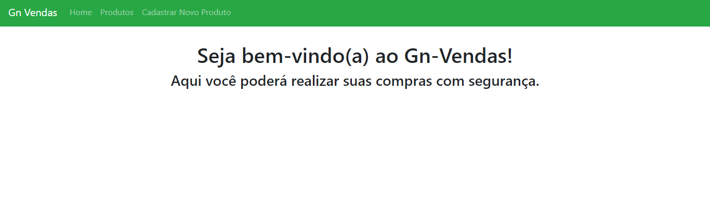
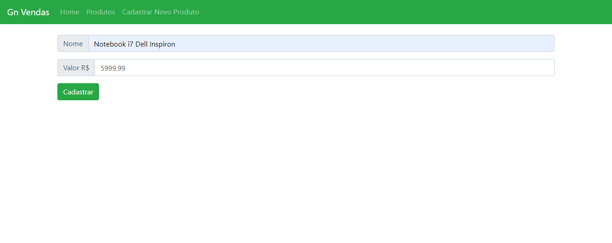
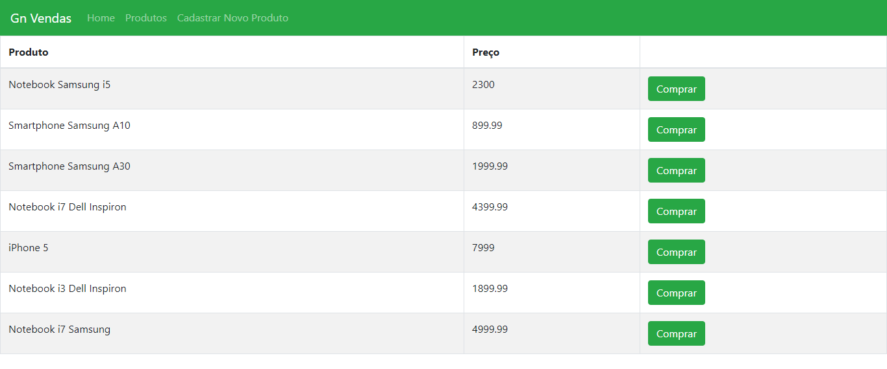
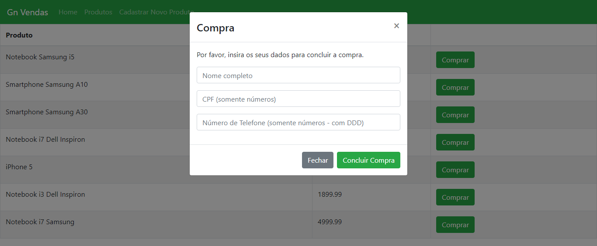
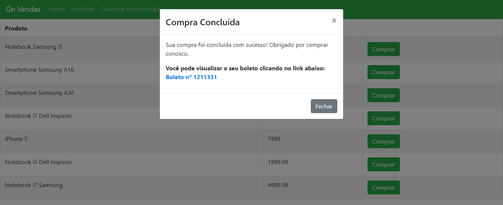

<h1 align="center">
 GN Vendas
</h1>

<p align="center">
  

  <a href="https://www.linkedin.com/in/amandasf/">
    
  </a>
  
  
  
  <a href="https://github.com/amanda-santos/gn-vendas/commits/master">
    
  </a>
  
  <a href="https://github.com/amanda-santos/gn-vendas/issues">
    
  </a>
  
  
</p>

<p align="center">
  <a href="#-about-the-project">About the project</a>&nbsp;&nbsp;&nbsp;|&nbsp;&nbsp;&nbsp;
  <a href="#-technologies">Technologies</a>&nbsp;&nbsp;&nbsp;|&nbsp;&nbsp;&nbsp;
  <a href="#-getting-started">Getting started</a>&nbsp;&nbsp;&nbsp;|&nbsp;&nbsp;&nbsp;
  <a href="#-how-to-contribute">How to contribute</a>&nbsp;&nbsp;&nbsp;|&nbsp;&nbsp;&nbsp;
  <a href="#-license">License</a>
</p>

## 👩🏻‍💻 About the project

<p>This project simulates a sales system, containing the registration and listing of products and the purchase with charge generation. Developed as a technical challenge for Gerencianet.</p>

## 🚀 Technologies

Technologies that I used to develop this project:

- MySQL
- Node.js
- React.js
- JavaScript
- HTML5
- CSS3
- Sequelize
- Express
- React Bootstrap

## ⌨ Getting started

Running the backend:
- Inside the backend folder, run `npm i` or `yarn` to install the dependencies
- Alter `config/database.js`, adding the setup of your MySQL database
- Run `npx sequelize db:create` or `yarn sequelize db:create` to create the database
- Run the migrations with `npx sequelize db:migrate` or `yarn sequelize db:migrate`
- Finally, run server with `npm run dev` or `yarn dev`

Running the frontend:
- Inside the frontend folder, run `npm i` or `yarn` to install the dependencies
- Run with `npm start` or `yarn start`

## 🖥 Preview







## 🤔 How to contribute

**Make a fork of this repository**

```bash
# Fork using GitHub official command line
# If you don't have the GitHub CLI, use the web site to do that.

$ gh repo fork amanda-santos/gn-vendas
```

**Follow the steps below**

```bash
# Clone your fork
$ git clone your-fork-url && cd gn-vendas

# Create a branch with your feature
$ git checkout -b my-feature

# Make the commit with your changes
$ git commit -m 'feat: My new feature'

# Send the code to your remote branch
$ git push origin my-feature
```

After your pull request is merged, you can delete your branch

## 📝 License

This project is licensed under the MIT License - see the [LICENSE](LICENSE) file for details.

---

Made with 💜 by Amanda Santos <br />
👋 [See my LinkedIn](https://www.linkedin.com/in/amandasf/)
